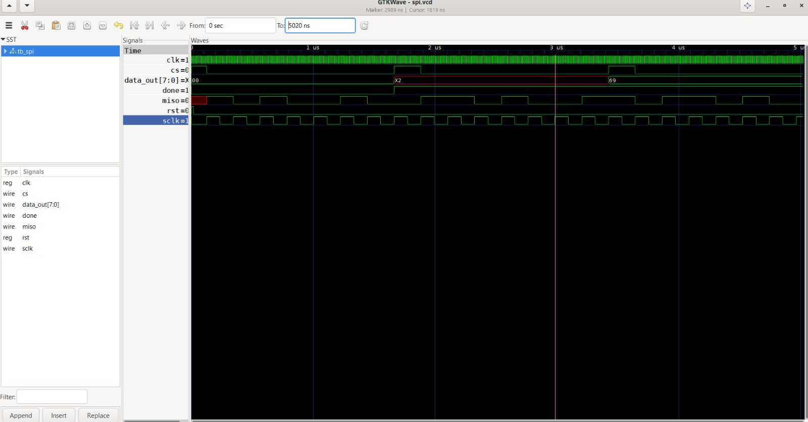
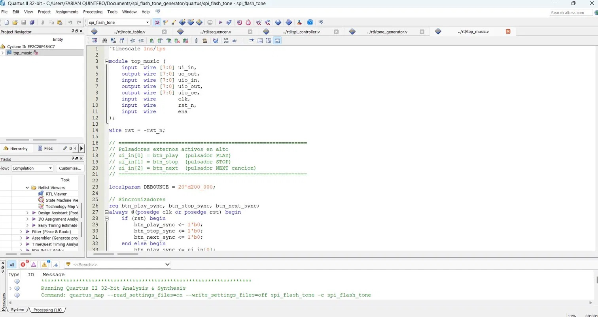
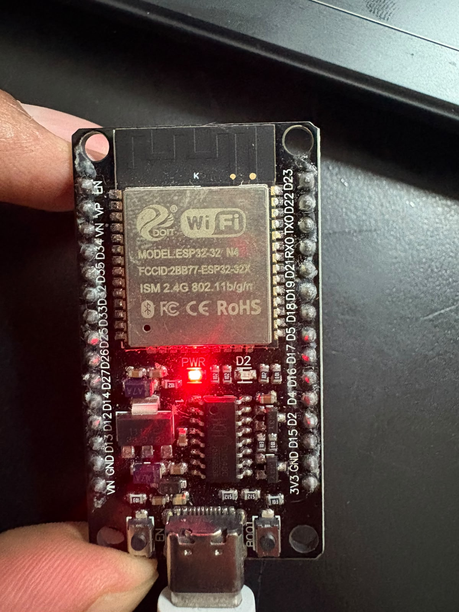
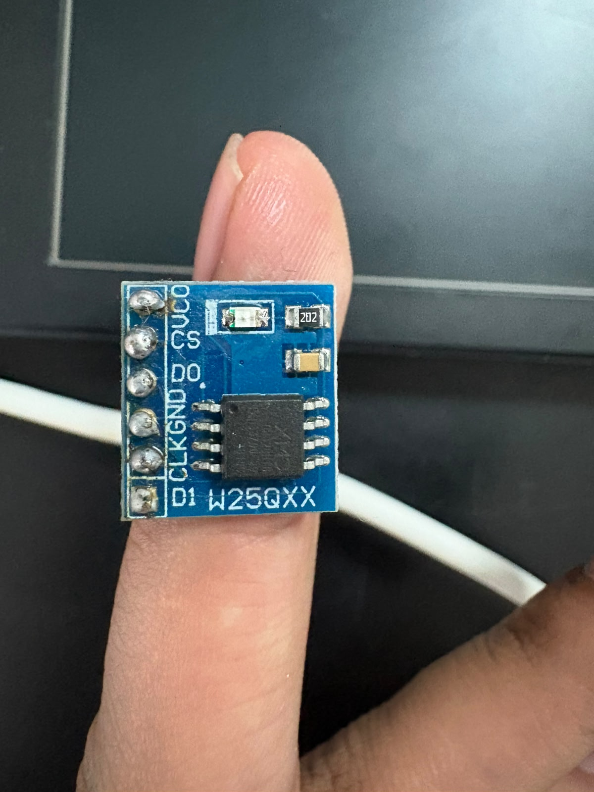
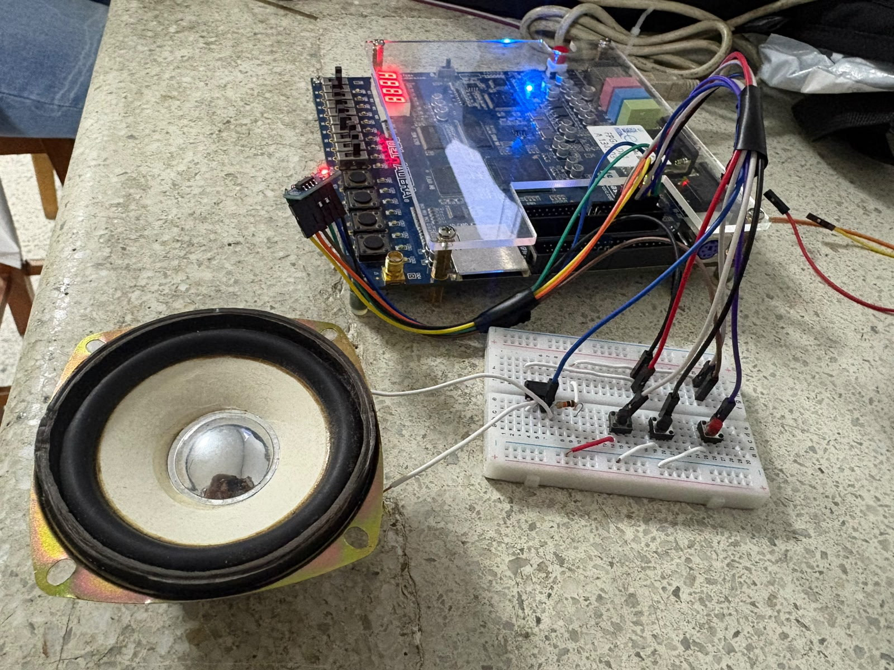

<!---
This file is used to generate your project datasheet.
-->

## How it works

This project implements a **musical tone generator based on Direct Digital Synthesis (DDS)**. It reads note sequences stored in an external W25Q32 SPI Flash memory and generates PWM audio output through a speaker amplifier.

### System Architecture
┌─────────────────────────────────────────────────────────┐
│                    tt_um_tone_gen_spi                    │
│                                                         │
│  ┌──────────┐    ┌───────────┐    ┌──────────────────┐  │
│  │ Debounce │    │ Sequencer │    │  SPI Controller  │  │
│  │  Logic   │───▶│   FSM     │───▶│  (Mode 0, SPI)   │  │
│  └──────────┘    └───────────┘    └──────────────────┘  │
│       ▲               │                    │             │
│       │               ▼                    ▼             │
│  Push │        ┌────────────┐    ┌──────────────────┐   │
│  Buttons       │ Note Table │    │  W25Q32 Flash    │   │
│               │  (Divisors)│    │  (3 Songs)       │   │
│               └────────────┘    └──────────────────┘   │
│                      │                                  │
│                      ▼                                  │
│               ┌────────────┐                            │
│               │   Tone     │                            │
│               │ Generator  │                            │
│               └────────────┘                            │
│                      │                                  │
│                      ▼                                  │
│               PWM Audio Output ──▶ LM358 ──▶ Speaker    │
└─────────────────────────────────────────────────────────┘

### Module Description

| Module | Description |
|--------|-------------|
| `top_music.v` | Top level module. Handles button debounce, play/stop/next control and song selection |
| `sequencer.v` | FSM sequencer. Controls playback timing, reads note/duration pairs from Flash |
| `spi_controller.v` | SPI Mode 0 controller. Reads bytes from W25Q32 at 1.25 MHz |
| `note_table.v` | Lookup table mapping note IDs to frequency divisors for 10 MHz clock |
| `tone_generator.v` | Square wave PWM generator at the correct musical frequency |

### Clock and Timing

- **System Clock**: 10 MHz
- **SPI Clock**: 1.25 MHz (CLK_DIV = 4)
- **BPM**: 120
- **Tick duration**: 125 ms (1,250,000 cycles at 10 MHz)

### Note Encoding

Notes are stored in Flash memory as pairs of bytes `[note_id, duration]`:

| Note ID | Note | Frequency (Hz) | Divisor |
|---------|------|----------------|---------|
| 0x00 | Silence | 0 | 0 |
| 0x08 | Do4 (C4) | 261.63 | 19112 |
| 0x09 | Re4 (D4) | 293.66 | 17026 |
| 0x0A | Mi4 (E4) | 329.63 | 15169 |
| 0x0B | Fa4 (F4) | 349.23 | 14317 |
| 0x0C | Sol4 (G4) | 392.00 | 12755 |
| 0x0D | La4 (A4) | 440.00 | 11364 |
| 0x0E | Si4 (B4) | 493.88 | 10124 |
| 0x0F | Do5 (C5) | 523.25 | 9556 |
| 0xFF | End of song | - | - |

### Duration Encoding

| Duration | Value | Time at 120 BPM |
|----------|-------|-----------------|
| Semicorchea | 0x01 | 125 ms |
| Negra | 0x02 | 250 ms |
| Blanca | 0x04 | 500 ms |
| Redonda | 0x08 | 1000 ms |

### Songs Stored in Flash

| Song | Start Address | Size |
|------|--------------|------|
| Beat It (Michael Jackson) | 0x000000 | 193 bytes |
| Cumpleaños Feliz | 0x000100 | 117 bytes |
| Super Mario Bros | 0x000200 | 131 bytes |

### RTL Simulation

The design was verified using Icarus Verilog with a fake Flash model (`fake_flash.v`) that replicates the W25Q32 SPI protocol behavior.



*GTKWave simulation showing SPI controller reading note data from Flash memory. The CS# signal goes low, SCLK toggles at 1.25 MHz, and data is transferred via MISO.*

### Quartus II Synthesis

The design was synthesized using Quartus II for the Cyclone II EP2C20F484C7 FPGA (Altera DE1 board).



*Quartus II Analysis & Synthesis running on the top_music module.*

## How to test

### Required Hardware

| Component | Description |
|-----------|-------------|
| Altera DE1 (Cyclone II) | FPGA development board |
| W25Q32 Flash Module | SPI Flash memory with 32Mbit capacity |
| ESP32-WROOM-32 | Used to program the Flash via MicroPython |
| LM358 Op-Amp | Audio amplifier (gain 10x) |
| Speaker 4Ω 8W | Audio output |
| 3x Push buttons | PLAY, STOP, NEXT controls |
| 10kΩ, 100kΩ resistors | For LM358 amplifier circuit |
| Breadboard + jumper wires | For circuit connections |

### Step 1: Program the Flash Memory

Connect the W25Q32 Flash to the ESP32 as follows:

| W25Q32 Pin | ESP32 Pin | Description |
|-----------|-----------|-------------|
| VCC | 3.3V | Power supply |
| GND | GND | Ground |
| S/CS# | GPIO 13 | Chip Select |
| CLK | GPIO 19 | SPI Clock |
| D1/MOSI | GPIO 23 | Master Out Slave In |
| D0/MISO | GPIO 18 | Master In Slave Out |



*ESP32-WROOM-32 with MicroPython v1.24.1 used to program the W25Q32 Flash memory.*



*W25Q32 SPI Flash memory module. Stores 3 songs: Beat It, Cumpleaños Feliz and Super Mario Bros.*

Run the following command to program the Flash:

```bash
mpremote connect COM7 run songs/flash_writer.py
```

Verify the Flash was programmed correctly:

```python
from machine import SPI, Pin
spi = SPI(1, baudrate=1000000, polarity=0, phase=0,
          sck=Pin(19), mosi=Pin(23), miso=Pin(18))
cs = Pin(13, Pin.OUT)
cs.value(1)

def read_bytes(addr, n):
    cs.value(0)
    spi.write(bytes([0x03, (addr>>16)&0xFF,
                     (addr>>8)&0xFF, addr&0xFF]))
    data = spi.read(n)
    cs.value(1)
    return data

print("Song 1:", [hex(b) for b in read_bytes(0x000000, 10)])
print("Song 2:", [hex(b) for b in read_bytes(0x000100, 10)])
print("Song 3:", [hex(b) for b in read_bytes(0x000200, 10)])
```

### Step 2: Connect the Hardware

Connect the W25Q32 Flash and peripherals to the DE1 GPIO_0 connector:

| GPIO_0 Pin | Signal | Connect To |
|-----------|--------|-----------|
| Pin 1 | audio_out | LM358 amplifier input (+) |
| Pin 2 | MISO | Flash D0 |
| Pin 3 | CS# | Flash S/CS# |
| Pin 4 | MOSI | Flash D1 |
| Pin 5 | CLK | Flash CLK |
| Pin 6 | btn_play | Push button PLAY |
| Pin 7 | btn_stop | Push button STOP |
| Pin 8 | btn_next | Push button NEXT |
| Pin 29 | VCC 3.3V | Flash VCC |
| Pin 30 | GND | Flash GND + Amplifier GND |

### Step 3: LM358 Amplifier Circuit
                100kΩ
          ┌────/\/\/────┐
          │             │
FPGA pin1 ───▶ pin3(+)LM358 pin1(out)───▶ Speaker(+)
│             │
10kΩ      pin2(-)──┘
│
GND ◀──── Speaker(-)
VCC (5V) ──▶ pin8
GND      ──▶ pin4

### Step 4: Program the FPGA

1. Open Quartus II and load the project
2. Compile: **Processing → Start Compilation** (`Ctrl+L`)
3. Program: **Tools → Programmer → Start**

### Step 5: Play Music



*Complete circuit showing the DE1 FPGA board connected to the breadboard with push buttons, W25Q32 Flash memory and speaker.*

| Button | Action |
|--------|--------|
| PLAY (ui_in[0]) | Start playing current song |
| STOP (ui_in[1]) | Stop playback |
| NEXT (ui_in[2]) | Select next song (cycles: Beat It → Cumpleaños → Mario → Beat It) |

Press **PLAY** to start playing. The system will read notes from the Flash memory via SPI and generate PWM audio output. Press **NEXT** to change songs and **STOP** to pause.

### Pin Assignment (Quartus II)

| Signal | Pin | Description |
|--------|-----|-------------|
| clk | PIN_L1 | 10 MHz system clock |
| rst_n | PIN_R22 | Reset (KEY0, active low) |
| ui_in[0] | PIN_B15 | btn_play |
| ui_in[1] | PIN_A16 | btn_stop |
| ui_in[2] | PIN_B16 | btn_next |
| uo_out[0] | PIN_A13 | audio_out (PWM) |
| uo_out[1] | PIN_A14 | SPI CS# |
| uo_out[2] | PIN_A15 | SPI CLK |
| uo_out[3] | PIN_B14 | SPI MOSI |
| uio_in[0] | PIN_B13 | SPI MISO |